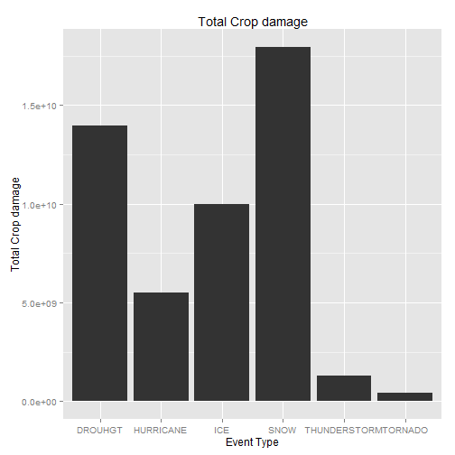

US Storm Data analysis and impacts to public health and economic consequences
=============================================================================

# Synopsis: 
  The severe weather event data from NOAA for the years 1950 to 2011 has been analysed to study the impact of sever weather events on public health in terms of injuries and loss of life. This study also looks at the economic costs and consequences. 

The source data is available [here] (https://d396qusza40orc.cloudfront.net/repdata%2Fdata%2FStormData.csv.bz2).  The documentation about this is available at [storm data documentation] (https://d396qusza40orc.cloudfront.net/repdata%2Fpeer2_doc%2Fpd01016005curr.pdf)  
The National Climatic Data Center Storm Events [FAQ] (https://d396qusza40orc.cloudfront.net/repdata%2Fpeer2_doc%2FNCDC%20Storm%20Events-FAQ%20Page.pdf)

## Data Processing
### 1.0 The storm from NOAA data is loaded and saved to the R project directory
### 1.1 The compressed csv file is read in to memory
### 1.2 Look at data summary


```r
library(plyr)
```

```
## Warning: package 'plyr' was built under R version 3.0.3
```

```r
library(ggplot2)
```

```
## Warning: package 'ggplot2' was built under R version 3.0.3
```

```r

StormData <- read.csv("F:/R-Projects/reprodResearch-assign2/repdata-data-StormData.csv.bz2")
summary(StormData)
```

```
##     STATE__                  BGN_DATE             BGN_TIME     
##  Min.   : 1.0   5/25/2011 0:00:00:  1202   12:00:00 AM: 10163  
##  1st Qu.:19.0   4/27/2011 0:00:00:  1193   06:00:00 PM:  7350  
##  Median :30.0   6/9/2011 0:00:00 :  1030   04:00:00 PM:  7261  
##  Mean   :31.2   5/30/2004 0:00:00:  1016   05:00:00 PM:  6891  
##  3rd Qu.:45.0   4/4/2011 0:00:00 :  1009   12:00:00 PM:  6703  
##  Max.   :95.0   4/2/2006 0:00:00 :   981   03:00:00 PM:  6700  
##                 (Other)          :895866   (Other)    :857229  
##    TIME_ZONE          COUNTY         COUNTYNAME         STATE       
##  CST    :547493   Min.   :  0   JEFFERSON :  7840   TX     : 83728  
##  EST    :245558   1st Qu.: 31   WASHINGTON:  7603   KS     : 53440  
##  MST    : 68390   Median : 75   JACKSON   :  6660   OK     : 46802  
##  PST    : 28302   Mean   :101   FRANKLIN  :  6256   MO     : 35648  
##  AST    :  6360   3rd Qu.:131   LINCOLN   :  5937   IA     : 31069  
##  HST    :  2563   Max.   :873   MADISON   :  5632   NE     : 30271  
##  (Other):  3631                 (Other)   :862369   (Other):621339  
##                EVTYPE         BGN_RANGE       BGN_AZI      
##  HAIL             :288661   Min.   :   0          :547332  
##  TSTM WIND        :219940   1st Qu.:   0   N      : 86752  
##  THUNDERSTORM WIND: 82563   Median :   0   W      : 38446  
##  TORNADO          : 60652   Mean   :   1   S      : 37558  
##  FLASH FLOOD      : 54277   3rd Qu.:   1   E      : 33178  
##  FLOOD            : 25326   Max.   :3749   NW     : 24041  
##  (Other)          :170878                  (Other):134990  
##          BGN_LOCATI                  END_DATE             END_TIME     
##               :287743                    :243411              :238978  
##  COUNTYWIDE   : 19680   4/27/2011 0:00:00:  1214   06:00:00 PM:  9802  
##  Countywide   :   993   5/25/2011 0:00:00:  1196   05:00:00 PM:  8314  
##  SPRINGFIELD  :   843   6/9/2011 0:00:00 :  1021   04:00:00 PM:  8104  
##  SOUTH PORTION:   810   4/4/2011 0:00:00 :  1007   12:00:00 PM:  7483  
##  NORTH PORTION:   784   5/30/2004 0:00:00:   998   11:59:00 PM:  7184  
##  (Other)      :591444   (Other)          :653450   (Other)    :622432  
##    COUNTY_END COUNTYENDN       END_RANGE      END_AZI      
##  Min.   :0    Mode:logical   Min.   :  0          :724837  
##  1st Qu.:0    NA's:902297    1st Qu.:  0   N      : 28082  
##  Median :0                   Median :  0   S      : 22510  
##  Mean   :0                   Mean   :  1   W      : 20119  
##  3rd Qu.:0                   3rd Qu.:  0   E      : 20047  
##  Max.   :0                   Max.   :925   NE     : 14606  
##                                            (Other): 72096  
##            END_LOCATI         LENGTH           WIDTH            F         
##                 :499225   Min.   :   0.0   Min.   :   0   Min.   :0       
##  COUNTYWIDE     : 19731   1st Qu.:   0.0   1st Qu.:   0   1st Qu.:0       
##  SOUTH PORTION  :   833   Median :   0.0   Median :   0   Median :1       
##  NORTH PORTION  :   780   Mean   :   0.2   Mean   :   8   Mean   :1       
##  CENTRAL PORTION:   617   3rd Qu.:   0.0   3rd Qu.:   0   3rd Qu.:1       
##  SPRINGFIELD    :   575   Max.   :2315.0   Max.   :4400   Max.   :5       
##  (Other)        :380536                                   NA's   :843563  
##       MAG          FATALITIES     INJURIES         PROPDMG    
##  Min.   :    0   Min.   :  0   Min.   :   0.0   Min.   :   0  
##  1st Qu.:    0   1st Qu.:  0   1st Qu.:   0.0   1st Qu.:   0  
##  Median :   50   Median :  0   Median :   0.0   Median :   0  
##  Mean   :   47   Mean   :  0   Mean   :   0.2   Mean   :  12  
##  3rd Qu.:   75   3rd Qu.:  0   3rd Qu.:   0.0   3rd Qu.:   0  
##  Max.   :22000   Max.   :583   Max.   :1700.0   Max.   :5000  
##                                                               
##    PROPDMGEXP        CROPDMG        CROPDMGEXP          WFO        
##         :465934   Min.   :  0.0          :618413          :142069  
##  K      :424665   1st Qu.:  0.0   K      :281832   OUN    : 17393  
##  M      : 11330   Median :  0.0   M      :  1994   JAN    : 13889  
##  0      :   216   Mean   :  1.5   k      :    21   LWX    : 13174  
##  B      :    40   3rd Qu.:  0.0   0      :    19   PHI    : 12551  
##  5      :    28   Max.   :990.0   B      :     9   TSA    : 12483  
##  (Other):    84                   (Other):     9   (Other):690738  
##                                STATEOFFIC    
##                                     :248769  
##  TEXAS, North                       : 12193  
##  ARKANSAS, Central and North Central: 11738  
##  IOWA, Central                      : 11345  
##  KANSAS, Southwest                  : 11212  
##  GEORGIA, North and Central         : 11120  
##  (Other)                            :595920  
##                                                                                                                                                                                                     ZONENAMES     
##                                                                                                                                                                                                          :594029  
##                                                                                                                                                                                                          :205988  
##  GREATER RENO / CARSON CITY / M - GREATER RENO / CARSON CITY / M                                                                                                                                         :   639  
##  GREATER LAKE TAHOE AREA - GREATER LAKE TAHOE AREA                                                                                                                                                       :   592  
##  JEFFERSON - JEFFERSON                                                                                                                                                                                   :   303  
##  MADISON - MADISON                                                                                                                                                                                       :   302  
##  (Other)                                                                                                                                                                                                 :100444  
##     LATITUDE      LONGITUDE        LATITUDE_E     LONGITUDE_    
##  Min.   :   0   Min.   :-14451   Min.   :   0   Min.   :-14455  
##  1st Qu.:2802   1st Qu.:  7247   1st Qu.:   0   1st Qu.:     0  
##  Median :3540   Median :  8707   Median :   0   Median :     0  
##  Mean   :2875   Mean   :  6940   Mean   :1452   Mean   :  3509  
##  3rd Qu.:4019   3rd Qu.:  9605   3rd Qu.:3549   3rd Qu.:  8735  
##  Max.   :9706   Max.   : 17124   Max.   :9706   Max.   :106220  
##  NA's   :47                      NA's   :40                     
##                                            REMARKS           REFNUM      
##                                                :287433   Min.   :     1  
##                                                : 24013   1st Qu.:225575  
##  Trees down.\n                                 :  1110   Median :451149  
##  Several trees were blown down.\n              :   568   Mean   :451149  
##  Trees were downed.\n                          :   446   3rd Qu.:676723  
##  Large trees and power lines were blown down.\n:   432   Max.   :902297  
##  (Other)                                       :588295
```


Let us Look at the all column types in the StormData


```r
str(StormData)
```

```
## 'data.frame':	902297 obs. of  37 variables:
##  $ STATE__   : num  1 1 1 1 1 1 1 1 1 1 ...
##  $ BGN_DATE  : Factor w/ 16335 levels "1/1/1966 0:00:00",..: 6523 6523 4242 11116 2224 2224 2260 383 3980 3980 ...
##  $ BGN_TIME  : Factor w/ 3608 levels "00:00:00 AM",..: 272 287 2705 1683 2584 3186 242 1683 3186 3186 ...
##  $ TIME_ZONE : Factor w/ 22 levels "ADT","AKS","AST",..: 7 7 7 7 7 7 7 7 7 7 ...
##  $ COUNTY    : num  97 3 57 89 43 77 9 123 125 57 ...
##  $ COUNTYNAME: Factor w/ 29601 levels "","5NM E OF MACKINAC BRIDGE TO PRESQUE ISLE LT MI",..: 13513 1873 4598 10592 4372 10094 1973 23873 24418 4598 ...
##  $ STATE     : Factor w/ 72 levels "AK","AL","AM",..: 2 2 2 2 2 2 2 2 2 2 ...
##  $ EVTYPE    : Factor w/ 985 levels "   HIGH SURF ADVISORY",..: 834 834 834 834 834 834 834 834 834 834 ...
##  $ BGN_RANGE : num  0 0 0 0 0 0 0 0 0 0 ...
##  $ BGN_AZI   : Factor w/ 35 levels "","  N"," NW",..: 1 1 1 1 1 1 1 1 1 1 ...
##  $ BGN_LOCATI: Factor w/ 54429 levels "","- 1 N Albion",..: 1 1 1 1 1 1 1 1 1 1 ...
##  $ END_DATE  : Factor w/ 6663 levels "","1/1/1993 0:00:00",..: 1 1 1 1 1 1 1 1 1 1 ...
##  $ END_TIME  : Factor w/ 3647 levels ""," 0900CST",..: 1 1 1 1 1 1 1 1 1 1 ...
##  $ COUNTY_END: num  0 0 0 0 0 0 0 0 0 0 ...
##  $ COUNTYENDN: logi  NA NA NA NA NA NA ...
##  $ END_RANGE : num  0 0 0 0 0 0 0 0 0 0 ...
##  $ END_AZI   : Factor w/ 24 levels "","E","ENE","ESE",..: 1 1 1 1 1 1 1 1 1 1 ...
##  $ END_LOCATI: Factor w/ 34506 levels "","- .5 NNW",..: 1 1 1 1 1 1 1 1 1 1 ...
##  $ LENGTH    : num  14 2 0.1 0 0 1.5 1.5 0 3.3 2.3 ...
##  $ WIDTH     : num  100 150 123 100 150 177 33 33 100 100 ...
##  $ F         : int  3 2 2 2 2 2 2 1 3 3 ...
##  $ MAG       : num  0 0 0 0 0 0 0 0 0 0 ...
##  $ FATALITIES: num  0 0 0 0 0 0 0 0 1 0 ...
##  $ INJURIES  : num  15 0 2 2 2 6 1 0 14 0 ...
##  $ PROPDMG   : num  25 2.5 25 2.5 2.5 2.5 2.5 2.5 25 25 ...
##  $ PROPDMGEXP: Factor w/ 19 levels "","-","?","+",..: 17 17 17 17 17 17 17 17 17 17 ...
##  $ CROPDMG   : num  0 0 0 0 0 0 0 0 0 0 ...
##  $ CROPDMGEXP: Factor w/ 9 levels "","?","0","2",..: 1 1 1 1 1 1 1 1 1 1 ...
##  $ WFO       : Factor w/ 542 levels ""," CI","$AC",..: 1 1 1 1 1 1 1 1 1 1 ...
##  $ STATEOFFIC: Factor w/ 250 levels "","ALABAMA, Central",..: 1 1 1 1 1 1 1 1 1 1 ...
##  $ ZONENAMES : Factor w/ 25112 levels "","                                                                                                                               "| __truncated__,..: 1 1 1 1 1 1 1 1 1 1 ...
##  $ LATITUDE  : num  3040 3042 3340 3458 3412 ...
##  $ LONGITUDE : num  8812 8755 8742 8626 8642 ...
##  $ LATITUDE_E: num  3051 0 0 0 0 ...
##  $ LONGITUDE_: num  8806 0 0 0 0 ...
##  $ REMARKS   : Factor w/ 436781 levels "","-2 at Deer Park\n",..: 1 1 1 1 1 1 1 1 1 1 ...
##  $ REFNUM    : num  1 2 3 4 5 6 7 8 9 10 ...
```


Let us look at the first 6 rows of the StormData

```r
head(StormData)
```

```
##   STATE__           BGN_DATE BGN_TIME TIME_ZONE COUNTY COUNTYNAME STATE
## 1       1  4/18/1950 0:00:00     0130       CST     97     MOBILE    AL
## 2       1  4/18/1950 0:00:00     0145       CST      3    BALDWIN    AL
## 3       1  2/20/1951 0:00:00     1600       CST     57    FAYETTE    AL
## 4       1   6/8/1951 0:00:00     0900       CST     89    MADISON    AL
## 5       1 11/15/1951 0:00:00     1500       CST     43    CULLMAN    AL
## 6       1 11/15/1951 0:00:00     2000       CST     77 LAUDERDALE    AL
##    EVTYPE BGN_RANGE BGN_AZI BGN_LOCATI END_DATE END_TIME COUNTY_END
## 1 TORNADO         0                                               0
## 2 TORNADO         0                                               0
## 3 TORNADO         0                                               0
## 4 TORNADO         0                                               0
## 5 TORNADO         0                                               0
## 6 TORNADO         0                                               0
##   COUNTYENDN END_RANGE END_AZI END_LOCATI LENGTH WIDTH F MAG FATALITIES
## 1         NA         0                      14.0   100 3   0          0
## 2         NA         0                       2.0   150 2   0          0
## 3         NA         0                       0.1   123 2   0          0
## 4         NA         0                       0.0   100 2   0          0
## 5         NA         0                       0.0   150 2   0          0
## 6         NA         0                       1.5   177 2   0          0
##   INJURIES PROPDMG PROPDMGEXP CROPDMG CROPDMGEXP WFO STATEOFFIC ZONENAMES
## 1       15    25.0          K       0                                    
## 2        0     2.5          K       0                                    
## 3        2    25.0          K       0                                    
## 4        2     2.5          K       0                                    
## 5        2     2.5          K       0                                    
## 6        6     2.5          K       0                                    
##   LATITUDE LONGITUDE LATITUDE_E LONGITUDE_ REMARKS REFNUM
## 1     3040      8812       3051       8806              1
## 2     3042      8755          0          0              2
## 3     3340      8742          0          0              3
## 4     3458      8626          0          0              4
## 5     3412      8642          0          0              5
## 6     3450      8748          0          0              6
```

Let us look at the last 6 rows of the StormData

```r
tail(StormData)
```

```
##        STATE__           BGN_DATE    BGN_TIME TIME_ZONE COUNTY
## 902292      47 11/28/2011 0:00:00 03:00:00 PM       CST     21
## 902293      56 11/30/2011 0:00:00 10:30:00 PM       MST      7
## 902294      30 11/10/2011 0:00:00 02:48:00 PM       MST      9
## 902295       2  11/8/2011 0:00:00 02:58:00 PM       AKS    213
## 902296       2  11/9/2011 0:00:00 10:21:00 AM       AKS    202
## 902297       1 11/28/2011 0:00:00 08:00:00 PM       CST      6
##                                  COUNTYNAME STATE         EVTYPE BGN_RANGE
## 902292 TNZ001>004 - 019>021 - 048>055 - 088    TN WINTER WEATHER         0
## 902293                         WYZ007 - 017    WY      HIGH WIND         0
## 902294                         MTZ009 - 010    MT      HIGH WIND         0
## 902295                               AKZ213    AK      HIGH WIND         0
## 902296                               AKZ202    AK       BLIZZARD         0
## 902297                               ALZ006    AL     HEAVY SNOW         0
##        BGN_AZI BGN_LOCATI           END_DATE    END_TIME COUNTY_END
## 902292                    11/29/2011 0:00:00 12:00:00 PM          0
## 902293                    11/30/2011 0:00:00 10:30:00 PM          0
## 902294                    11/10/2011 0:00:00 02:48:00 PM          0
## 902295                     11/9/2011 0:00:00 01:15:00 PM          0
## 902296                     11/9/2011 0:00:00 05:00:00 PM          0
## 902297                    11/29/2011 0:00:00 04:00:00 AM          0
##        COUNTYENDN END_RANGE END_AZI END_LOCATI LENGTH WIDTH  F MAG
## 902292         NA         0                         0     0 NA   0
## 902293         NA         0                         0     0 NA  66
## 902294         NA         0                         0     0 NA  52
## 902295         NA         0                         0     0 NA  81
## 902296         NA         0                         0     0 NA   0
## 902297         NA         0                         0     0 NA   0
##        FATALITIES INJURIES PROPDMG PROPDMGEXP CROPDMG CROPDMGEXP WFO
## 902292          0        0       0          K       0          K MEG
## 902293          0        0       0          K       0          K RIW
## 902294          0        0       0          K       0          K TFX
## 902295          0        0       0          K       0          K AFG
## 902296          0        0       0          K       0          K AFG
## 902297          0        0       0          K       0          K HUN
##                       STATEOFFIC
## 902292           TENNESSEE, West
## 902293 WYOMING, Central and West
## 902294          MONTANA, Central
## 902295          ALASKA, Northern
## 902296          ALASKA, Northern
## 902297            ALABAMA, North
##                                                                                                                                                            ZONENAMES
## 902292 LAKE - LAKE - OBION - WEAKLEY - HENRY - DYER - GIBSON - CARROLL - LAUDERDALE - TIPTON - HAYWOOD - CROCKETT - MADISON - CHESTER - HENDERSON - DECATUR - SHELBY
## 902293                                                                              OWL CREEK & BRIDGER MOUNTAINS - OWL CREEK & BRIDGER MOUNTAINS - WIND RIVER BASIN
## 902294                                                                                     NORTH ROCKY MOUNTAIN FRONT - NORTH ROCKY MOUNTAIN FRONT - EASTERN GLACIER
## 902295                                                                                                 ST LAWRENCE IS. BERING STRAIT - ST LAWRENCE IS. BERING STRAIT
## 902296                                                                                                                 NORTHERN ARCTIC COAST - NORTHERN ARCTIC COAST
## 902297                                                                                                                                             MADISON - MADISON
##        LATITUDE LONGITUDE LATITUDE_E LONGITUDE_
## 902292        0         0          0          0
## 902293        0         0          0          0
## 902294        0         0          0          0
## 902295        0         0          0          0
## 902296        0         0          0          0
## 902297        0         0          0          0
##                                                                                                                                                                                                                                                                                                                                                                                                                                                                                                                                                                                                                                                                                                                                                                                                                                                                                                                                                                                                                                                                                                                                                                                                                                                                                                                                                                                                                                                                                                                                                                                                                                                                                                                                                                                                                                                                                                                                                                                                                                                                                                        REMARKS
## 902292                                                                                                                                                                                                                                                                                                                                                                                                                                                                                                                                                                                                                                                                                                                                                                                                                                                                                                                                                                                                                                                                                                                                                                                                                                                                                                                                                                                                                                                                                                                                                                                                                                                                                                    EPISODE NARRATIVE: A powerful upper level low pressure system brought snow to portions of Northeast Arkansas, the Missouri Bootheel, West Tennessee and extreme north Mississippi. Most areas picked up between 1 and 3 inches of with areas of Northeast Arkansas and the Missouri Bootheel receiving between 4 and 6 inches of snow.EVENT NARRATIVE: Around 1 inch of snow fell in Carroll County.
## 902293                                                                                                                                                                                                                                                                                                                                                                                                                                                                                                                                                                                                                                                                                                                                                                                                                                                                                                                                                                                                                                                                                                                                                                                                                                                                                                                                                                                                                                                                                                                                                                                                                                                                                                                                                                                                                                           EPISODE NARRATIVE: A strong cold front moved south through north central Wyoming bringing high wind to the Meeteetse area and along the south slopes of the western Owl Creek Range. Wind gusts to 76 mph were recorded at Madden Reservoir.EVENT NARRATIVE: 
## 902294                                                                                                                                                                                                                                                                                                                                                                                                                                                                                                                                                                                                                                                                                                                                                                                                                                                                                                                                                                                                                                                                                                                                                                                                                                                                                                                                                                                                                                                                                                                                                                                                                                                                                                                                                                                      EPISODE NARRATIVE: A strong westerly flow aloft produced gusty winds at the surface along the Rocky Mountain front and over the plains of Central Montana. Wind gusts in excess of 60 mph were reported.EVENT NARRATIVE: A wind gust to 60 mph was reported at East Glacier Park 1ENE (the Two Medicine DOT site).
## 902295 EPISODE NARRATIVE: A 960 mb low over the southern Aleutians at 0300AKST on the 8th intensified to 945 mb near the Gulf of Anadyr by 2100AKST on the 8th. The low crossed the Chukotsk Peninsula as a 956 mb low at 0900AKST on the 9th, and moved into the southern Chukchi Sea as a 958 mb low by 2100AKST on the 9th. The low then tracked to the northwest and weakened to 975 mb about 150 miles north of Wrangel Island by 1500AKST on the 10th. The storm was one of the strongest storms to impact the west coast of Alaska since November 1974. \n\nZone 201: Blizzard conditions were observed at Wainwright from approximately 1153AKST through 1611AKST on the 9th. The visibility was frequently reduced to one quarter mile in snow and blowing snow. There was a peak wind gust to 43kt (50 mph) at the Wainwright ASOS. During this event, there was also a peak wind gust to \n68 kt (78 mph) at the Cape Lisburne AWOS. \n\nZone 202: Blizzard conditions were observed at Barrow from approximately 1021AKST through 1700AKST on the 9th. The visibility was frequently reduced to one quarter mile or less in blowing snow. There was a peak wind gust to 46 kt (53 mph) at the Barrow ASOS. \n\nZone 207: Blizzard conditions were observed at Kivalina from approximately 0400AKST through 1230AKST on the 9th. The visibility was frequently reduced to one quarter of a mile in snow and blowing snow. There was a peak wind gust to 61 kt (70 mph) at the Kivalina ASOS.  The doors to the village transportation shed were blown out to sea.  Many homes lost portions of their tin roofing, and satellite dishes were ripped off of roofs. One home had its door blown off.  At Point Hope, severe blizzard conditions were observed. There was a peak wind gust of 68 kt (78 mph) at the Point Hope AWOS before power was lost to the AWOS. It was estimated that the wind gusted as high as 85 mph in the village during the height of the storm during the morning and early afternoon hours on the 9th. Five power poles were knocked down in the storm EVENT NARRATIVE: 
## 902296 EPISODE NARRATIVE: A 960 mb low over the southern Aleutians at 0300AKST on the 8th intensified to 945 mb near the Gulf of Anadyr by 2100AKST on the 8th. The low crossed the Chukotsk Peninsula as a 956 mb low at 0900AKST on the 9th, and moved into the southern Chukchi Sea as a 958 mb low by 2100AKST on the 9th. The low then tracked to the northwest and weakened to 975 mb about 150 miles north of Wrangel Island by 1500AKST on the 10th. The storm was one of the strongest storms to impact the west coast of Alaska since November 1974. \n\nZone 201: Blizzard conditions were observed at Wainwright from approximately 1153AKST through 1611AKST on the 9th. The visibility was frequently reduced to one quarter mile in snow and blowing snow. There was a peak wind gust to 43kt (50 mph) at the Wainwright ASOS. During this event, there was also a peak wind gust to \n68 kt (78 mph) at the Cape Lisburne AWOS. \n\nZone 202: Blizzard conditions were observed at Barrow from approximately 1021AKST through 1700AKST on the 9th. The visibility was frequently reduced to one quarter mile or less in blowing snow. There was a peak wind gust to 46 kt (53 mph) at the Barrow ASOS. \n\nZone 207: Blizzard conditions were observed at Kivalina from approximately 0400AKST through 1230AKST on the 9th. The visibility was frequently reduced to one quarter of a mile in snow and blowing snow. There was a peak wind gust to 61 kt (70 mph) at the Kivalina ASOS.  The doors to the village transportation shed were blown out to sea.  Many homes lost portions of their tin roofing, and satellite dishes were ripped off of roofs. One home had its door blown off.  At Point Hope, severe blizzard conditions were observed. There was a peak wind gust of 68 kt (78 mph) at the Point Hope AWOS before power was lost to the AWOS. It was estimated that the wind gusted as high as 85 mph in the village during the height of the storm during the morning and early afternoon hours on the 9th. Five power poles were knocked down in the storm EVENT NARRATIVE: 
## 902297                           EPISODE NARRATIVE: An intense upper level low developed on the 28th at the base of a highly amplified upper trough across the Great Lakes and Mississippi Valley.  The upper low closed off over the mid South and tracked northeast across the Tennessee Valley during the morning of the 29th.   A warm conveyor belt of heavy rainfall developed in advance of the low which dumped from around 2 to over 5 inches of rain across the eastern two thirds of north Alabama and middle Tennessee.  The highest rain amounts were recorded in Jackson and DeKalb Counties with 3 to 5 inches.  The rain fell over 24 to 36 hour period, with rainfall remaining light to moderate during most its duration.  The rainfall resulted in minor river flooding along the Little River, Big Wills Creek and Paint Rock.   A landslide occurred on Highway 35 just north of Section in Jackson County.  A driver was trapped in his vehicle, but was rescued unharmed.  Trees, boulders and debris blocked 100 to 250 yards of Highway 35.\n\nThe rain mixed with and changed to snow across north Alabama during the afternoon and  evening hours of the 28th, and lasted into the 29th.  The heaviest bursts of snow occurred in northwest Alabama during the afternoon and evening hours, and in north central and northeast Alabama during the overnight and morning hours.  Since ground temperatures were in the 50s, and air temperatures in valley areas only dropped into the mid 30s, most of the snowfall melted on impact with mostly trace amounts reported in valley locations.  However, above 1500 foot elevation, snow accumulations of 1 to 2 inches were reported.  The heaviest amount was 2.3 inches on Monte Sano Mountain, about 5 miles northeast of Huntsville.EVENT NARRATIVE: Snowfall accumulations of up to 2.3 inches were reported on the higher elevations of eastern Madison County.  A snow accumulation of 1.5 inches was reported 2.7 miles south of Gurley, while 2.3 inches was reported 3 miles east of Huntsville atop Monte Sano Mountain.
##        REFNUM
## 902292 902292
## 902293 902293
## 902294 902294
## 902295 902295
## 902296 902296
## 902297 902297
```


### 2.1 Impact of severe weather on population
First convert all EVTYPE to upper case, also convert FATALITIES & INJURIES columns to numeric

```r
StormData$EVTYPE = toupper(StormData$EVTYPE)
StormData$FATALITIES = as.numeric(StormData$FATALITIES)
StormData$INJURIES = as.numeric(StormData$INJURIES)
```


Select only those rows where FATALITIES >0 or INJURIES > 0 


```r
library(plyr)
```

```
## Warning: package 'plyr' was built under R version 3.0.3
```

```r
StormData$EVCOUNT = 1
# fix all the differnt event type names used to simple buckets

fixEvent = function(x) {
    if (any(grepl("TORNADO", x))) 
        e = "TORNADO" else if (any(grepl("DROUGHT", x))) 
        e = "DROUHGT" else if (any(grepl("THUNDERSTORM|TSTM|LIGHTNING", x))) 
        e = "THUNDERSTORM" else if (any(grepl("HURRICANE|TYPHOON|WATERSPOUT|FLOYD", x))) 
        e = "HURRICANE" else if (any(grepl("ICE|HAIL|FREEZE|SLEET", x))) 
        e = "ICE" else if (any(grepl("SNOW|AVALANCHE|BLIZZARD|", x))) 
        e = "SNOW" else if (any(grepl("HEAT|TEMPERATURE", x))) 
        e = "HEAT" else if (any(grepl("STORM", x))) 
        e = "STORM" else if (any(grepl("FLOOD", x))) 
        e = "FLOOD" else if (any(grepl("COLD", x))) 
        e = "COLD" else if (any(grepl("FIRE|", x))) 
        e = "FIRE" else e = "OTHER"
    e
}

StormData$EVTYPE = mapply(fixEvent, StormData$EVTYPE)
popImpactByEvtype = ddply(StormData, "EVTYPE", summarize, TotalFatalities = sum(FATALITIES), 
    TotalInjuries = sum(INJURIES), TotalEventCnt = sum(EVCOUNT))

p1 = popImpactByEvtype[popImpactByEvtype$TotalFatalities > 0 | popImpactByEvtype$TotalInjuries > 
    0, ]

p1$TotalImpacted = p1$TotalFatalities + p1$TotalInjuries
```


```r

mostImpacting = p1[order(-p1$TotalImpacted), ]

# mostImpacting
```


Calculate the Economic Impact by events


```r
costMult = function(d, e) {
    exp1 = toupper(substr(e, 1, 1))
    if (exp1 == "K") 
        multp = 1000 else if (exp1 == "M") 
        multp = 1e+06 else if (exp1 == "B") 
        multp = 1e+09 else multp = 1
    d * multp
}

StormEconImpact = StormData[StormData$PROPDMG != 0 | StormData$CROPDMG != 0, 
    ]

StormEconImpact$propdmg = mapply(costMult, StormEconImpact$PROPDMG, StormEconImpact$PROPDMGEXP)
StormEconImpact$cropdmg = mapply(costMult, StormEconImpact$CROPDMG, StormEconImpact$CROPDMGEXP)

StormEconDmg = StormEconImpact[, c(8, 39, 40)]
StormEconDmg$TotalDamage = StormEconDmg$propdmg + StormEconDmg$cropdmg

# head(StormEconDmg[order(-StormEconDmg$TotalDamage),])

EconImpactByEvtype = ddply(StormEconDmg, "EVTYPE", summarize, TotalDamage = sum(TotalDamage), 
    TotalPropDamge = sum(propdmg), TotalCropDamage = sum(cropdmg))
```

## 3.0 Results

Plot Total population impacted by the Event Type

```r
library(ggplot2)
```

```
## Warning: package 'ggplot2' was built under R version 3.0.3
```

```r
qplot(p1$EVTYPE, p1$TotalImpacted, geom = "histogram", xlab = "Event Type", 
    ylab = "Total Impacted(Fatalities+Injured", main = "Total population impact (total fatalities + total injuries)")
```

```
## Mapping a variable to y and also using stat="bin".
##   With stat="bin", it will attempt to set the y value to the count of cases in each group.
##   This can result in unexpected behavior and will not be allowed in a future version of ggplot2.
##   If you want y to represent counts of cases, use stat="bin" and don't map a variable to y.
##   If you want y to represent values in the data, use stat="identity".
##   See ?geom_bar for examples. (Deprecated; last used in version 0.9.2)
```

 

Total Fatalities caused by Event Type


```r
qplot(p1$EVTYPE, p1$TotalImpacted, geom = "histogram", xlab = "Event Type", 
    ylab = "Total Impacted(Fatalities+Injured", main = "Total population impact (total fatalities + total injuries)")
```

```
## Mapping a variable to y and also using stat="bin".
##   With stat="bin", it will attempt to set the y value to the count of cases in each group.
##   This can result in unexpected behavior and will not be allowed in a future version of ggplot2.
##   If you want y to represent counts of cases, use stat="bin" and don't map a variable to y.
##   If you want y to represent values in the data, use stat="identity".
##   See ?geom_bar for examples. (Deprecated; last used in version 0.9.2)
```

 

Total Injuries caused by Event Type

```r
qplot(p1$EVTYPE, p1$TotalImpacted, geom = "histogram", xlab = "Event Type", 
    ylab = "Total Impacted(Fatalities+Injured", main = "Total population impact (total fatalities + total injuries)")
```

```
## Mapping a variable to y and also using stat="bin".
##   With stat="bin", it will attempt to set the y value to the count of cases in each group.
##   This can result in unexpected behavior and will not be allowed in a future version of ggplot2.
##   If you want y to represent counts of cases, use stat="bin" and don't map a variable to y.
##   If you want y to represent values in the data, use stat="identity".
##   See ?geom_bar for examples. (Deprecated; last used in version 0.9.2)
```

 


Now plot the data for Total Damage

```r
library(ggplot2)
qplot(EconImpactByEvtype$EVTYPE, EconImpactByEvtype$TotalDamage, geom = "histogram", 
    xlab = "Event Type", ylab = "Total Economic Impact(property damage + crop damage", 
    main = "Total Economic impact (total property damage + total crop damage)")
```

```
## Mapping a variable to y and also using stat="bin".
##   With stat="bin", it will attempt to set the y value to the count of cases in each group.
##   This can result in unexpected behavior and will not be allowed in a future version of ggplot2.
##   If you want y to represent counts of cases, use stat="bin" and don't map a variable to y.
##   If you want y to represent values in the data, use stat="identity".
##   See ?geom_bar for examples. (Deprecated; last used in version 0.9.2)
```

 


Now plot the data for Total Property Damage

```r
library(ggplot2)
qplot(EconImpactByEvtype$EVTYPE, EconImpactByEvtype$TotalPropDamage, geom = "histogram", 
    xlab = "Event Type", ylab = "Total Property damage", main = "Total property damage")
```

```
## Error: 'where' is missing
```


Now plot the data for Total Crop Damage

```r
library(ggplot2)
qplot(EconImpactByEvtype$EVTYPE, EconImpactByEvtype$TotalCropDamage, geom = "histogram", 
    xlab = "Event Type", ylab = "Total Crop damage", main = "Total Crop damage")
```

```
## Mapping a variable to y and also using stat="bin".
##   With stat="bin", it will attempt to set the y value to the count of cases in each group.
##   This can result in unexpected behavior and will not be allowed in a future version of ggplot2.
##   If you want y to represent counts of cases, use stat="bin" and don't map a variable to y.
##   If you want y to represent values in the data, use stat="identity".
##   See ?geom_bar for examples. (Deprecated; last used in version 0.9.2)
```

 

